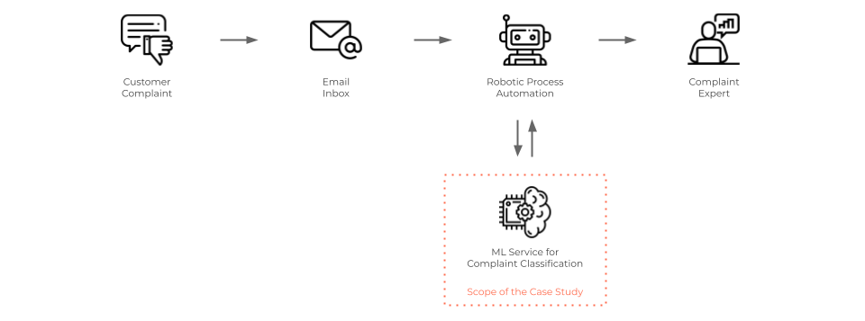
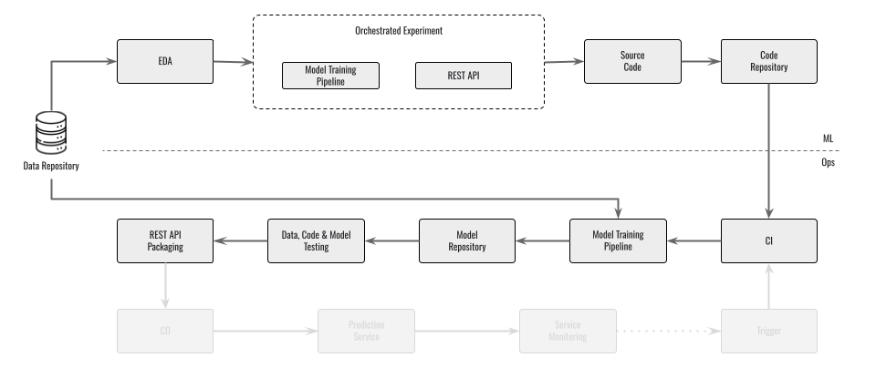
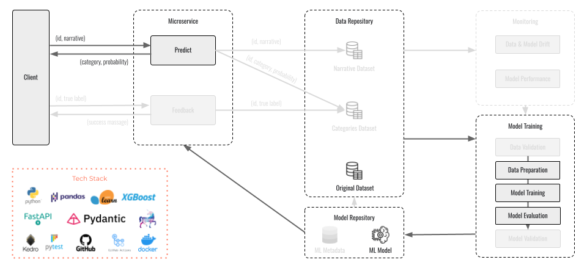
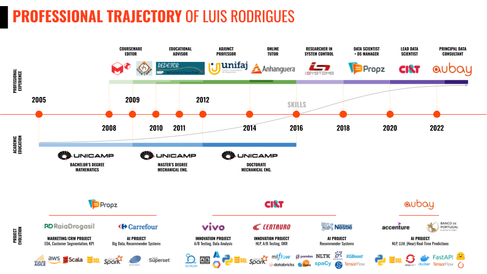

# ML-Based Text Classification

This repository presents a comprehensive case study designed for Machine Learning Engineers aimed at addressing the challenge of customer complaint email classification. 

<a name="toc"/></a>
## Table of Contents  
<!--ts-->
   1. [Project Overview](#overview)
   2. [Objective](#objective)
   3. [Implementation Details](#details)
   4. [Installation and Execution](#install)
   5. [Documentation](#doc)
   6. [About the Author](#author)
<!--te-->  

<a name="overview"/></a>
## 1. Project Overview
[Back to ToC](#toc)

Leveraging a curated [dataset](https://www.kaggle.com/datasets/shashwatwork/consume-complaints-dataset-fo-nlp) from Kaggle, this project showcases the application of machine learning techniques to efficiently sort customer emails into distinct categories based on their content, improving response times and enhancing customer service quality. Besides that, this project not only navigates through the complexities of machine learning model training but also places a significant emphasis on the deployment aspect, showcasing how to expose a trained ML model via a REST endpoint for inference.

<p align="center">
  
</p>

<a name="objective"/></a>
## 2. Objective
[Back to ToC](#toc)

The primary objective of this repository is to bridge the gap between machine learning model development and operational deployment, following the best MLOps practices to establish a continuous integration (CI), continuous delivery (CD), and continuous training (CT) pipeline. This initiative aims to equip Machine Learning Engineers with the necessary skills to not just build predictive models but also to efficiently deploy these models in a production environment, ensuring scalability, maintainability, and ease of access through web services.

<p align="center">
  
</p>

<a name="details"/></a>
## 3. Implementation Details
[Back to ToC](#toc)

Within this repository, practitioners will find a detailed guide on setting up an end-to-end machine learning project,  leveraging GitHub Actions to create a robust CI/CD/CT pipeline. This includes guidelines for setting up automated workflows to test code changes, train models with the latest data, evaluate model performance, and containerize the trained model for deployment as a REST API. This setup enables external applications to easily consume the predictive capabilities of the model, enhancing the responsiveness and effectiveness of customer service operations. Furthermore, the emphasis on best MLOps practices ensures that the deployed models are not only accurate and efficient but also resilient and easy to maintain over time.

<p align="center">
  
</p>

<a name="install"/></a>
## 4. Installation and Execution
[Back to ToC](#toc)

### 4.1 Installation 

To create a virtual environment and install the project dependencies, execute the setup file:

`dev_setup.bat`

Then, to train a text classifier model to be able to make predictions, run:

`kedro run --pipeline training`

### 4.2 Execution 

#### 4.2.1 Predictons via Kedro

To make predictions you can run the prediction pipeline:

`kedro run --pipeline prediction`

which will use `narrative` presented in `conf\base\parameters.yml` file.

#### 4.2.2 Predictons via FastAPI endpoint

Alternavely, you can start a server process by running

`python src\serving\app.py`

and make predictions via user interface availabe in:

`http://localhost:7860/docs#/`

Especifically, use the predict endpoint by providing the complaint info in a json format as follows:

```
{
  "id": "0141",
  "narrative": "current loan provident funding applied refinance provident funding variable interest rate went loan applied refinance downpayment reduce depth also monthly payment locked interest rate day current payment going approximately provided income debt information provident funding provident funding play game interest rate arm went provided every information suspended loan application able reach mortgage broker always get voicemail responded email underwriter approving due ratio"
}
```

#### 4.2.3 Predictons via FastAPI endpoint from a Docker container

You can also execute the classifier service from a Docker container:

```
docker build -t classifier_app -f Dockerfile .
docker run --rm --entrypoint "kedro" classifier_app run --pipeline training
docker container run -it -p 7860:7860 classifier_app
```

After, to make predictions, you must follow the instructions in 4.2.2.

<a name="doc"/></a>
## 5. Documentation
[Back to ToC](#toc)

To see the documentation built from docstrings within the project with [Sphinx](https://www.sphinx-doc.org/en/master/), see:

`/docs/_build/html/index.html`

To update the documentation, follow the instructions from the page [Add documentation to a Kedro project](https://docs.kedro.org/en/stable/tutorial/package_a_project.html#add-documentation-to-a-kedro-project).


Besides that, it's also available a presentation to showcase the project as a study case for Machine Learning Engineering, see:

`/docs/presentation/Case Study - MLE - Customer Complaints Email Classification.pdf`

<a name="author"/></a>
## 6. About the Author
[Back to ToC](#toc)

[Luis Rodrigues](https://www.linkedin.com/in/luisrodriguesphd/) graduated from University of Campinas, Brazil, with a BSc in Mathematics, an MSc in Mechanical Engineering, and a PhD in Mechanical Engineering.

He has over 8 years of experience in the Data Science field, developing Machine Learning products and services that deliver great customer experiences and significant business impact. His main contributions have been in Natural Language Processing (NLP), Recommender Systems, Marketing and CRM, and Time-Series Forecasting projects for Banking, Consumer Packaged Goods, Retail and Telecommunications industries.

Luis is currently a Principal Data Scientist at DEUS, an AI company focused on human-centered solutions, where he helps lead the development of a state-of-the-art Retrieval-Augmented Generation (RAG) solution, playing a pivotal role in architecting the underlying models, optimizing retrieval mechanisms for efficiency and precision, and integrating diverse data sources to enrich the solution's knowledge base.

Prior to that, he was a Principal Data Consultant at Aubay Portugal, an information technology consulting firm, where he led an NLP project for Banco de Portugal to optimize business decision-making through AI services such as summarization, information extraction (keywords and named entities), complaint text classification, and financial sentiment analysis.

Previously, Luis was Lead Data Scientist at CI&T, a digital transformation company, where he specially led the development of a recommender system for Nestlé, which increased sales by 6%, and he led the Data Science team of Propz, a CRM and marketing company for retail, where he mainly developed a recommender system for Carrefour, whose personalized recommendations helped to leverage their revenue by 3%.

He also served as a researcher at I.Systems, developing analytic strategies for modeling, forecasting, control and optimization of water distribution systems, and at University of Campinas, focusing on system and control theory and their applications in active control of noise and vibration and robot trajectory tracking problems.

<p align="center">
  
</p>